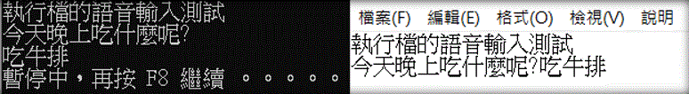

# Whisper_ASR
Whisper_ASR：彥杰修改的 whisper_real_time 語音輸入法<br>
參考網站：<https://github.com/davabase/whisper_real_time>
<br><br>
程式執行需要將[`ffmpeg`](https://ffmpeg.org/)加入環境變數 Path 中。<br>
ffmpeg：<https://ffmpeg.org/>
<br><br>
游標放的位置，就可以開始語音輸入。下圖左CMD，右記事本。

<br><br>
在Releases發表那邊，下載CPU或GPU版本。如果使用GPU版本記得先更新自己電腦顯卡的驅動程式。
<br>
將資料夾解壓縮後，執行如下指令：
```
whisper_asr.exe                （預設模型small）
whisper_asr.exe --model base   （使用模型base）
whisper_asr.exe --model medium （使用模型medium）
```
可以用這些模型["tiny", "base", "small", "medium", "large"]
第一次執行會自動下載。
<br><br>
小結：
whisper即時中文語音辨識建議用模型small。在當前電腦環境下，CPU執行簡單一句話大概8-10秒鐘，GPU執行大概2-3秒。GPU+模型small速度比較接近語音辨識可以接受的速度，且辨識結果勉强可以接受。


----

英文說明：

# Whisper_ASR
Whisper_ASR: whisper_real_time voice input method modified by Yanjie<br>
Reference website: <https://github.com/davabase/whisper_real_time>
<br><br>
Program execution needs to add [`ffmpeg`](https://ffmpeg.org/) to the environment variable Path. <br>
ffmpeg: <https://ffmpeg.org/>
<br><br>
You can start voice input at the position where the cursor is placed. The picture below shows CMD on the left and Notepad on the right.

<br><br>
On the Releases side, download the CPU or GPU version. If you use the GPU version, remember to update the driver of your computer graphics card first.
<br>
After decompressing the folder, execute the following command:
```
whisper_asr.exe (preset model small)
whisper_asr.exe --model base (use model base)
whisper_asr.exe --model medium (use model medium)
```
You can use these models ["tiny", "base", "small", "medium", "large"]
The first execution will automatically download.
<br><br>
summary:
The model small is recommended for whisper real-time Chinese speech recognition. In the current computer environment, the CPU executes a simple sentence for about 8-10 seconds, and the GPU executes for about 2-3 seconds. The speed of the GPU+ model small is relatively close to the acceptable speed of speech recognition, and the recognition results are barely acceptable.